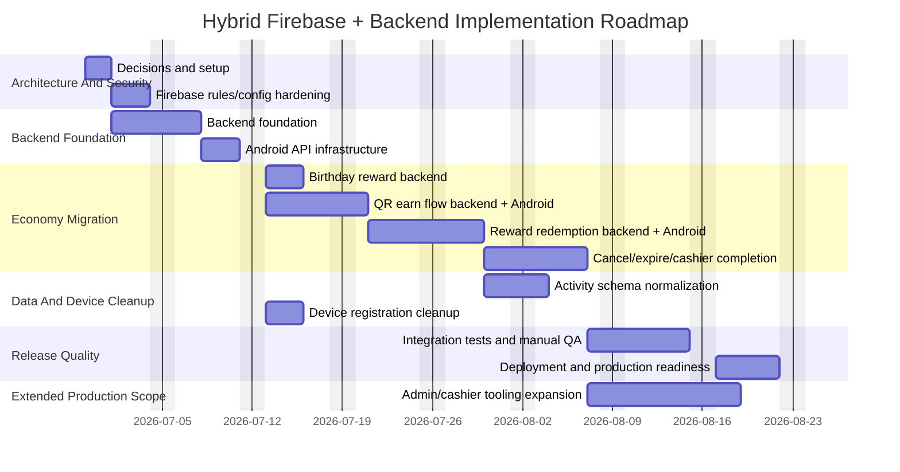

# Hybrid Backend Implementation Roadmap

**Date:** 2026-06-28  
**Source architecture:** `docs/HYBRID_FIREBASE_BACKEND_PLAN.md`  
**Role perspective:** Software architect + senior full-stack engineer  
**Target:** Android loyalty app with Firebase Auth, Firestore read models, FCM, and backend-owned loyalty operations.

---

## 1. Executive Summary

The project should move from "Android app directly writes important Firestore data" to "backend owns every trusted business operation." Firebase remains useful, but its responsibilities are reduced:

- Firebase Auth identifies users.
- Firestore becomes a mobile read model and lightweight config/catalog store.
- FCM delivers push notifications.
- Backend owns QR codes, points, visits, reward redemption, birthday rewards, device registration, admin/cashier actions, and audit logs.

The recommended first implementation does **not** require PostgreSQL. Use backend-owned Firestore transactions first because it is cheaper, faster to deliver, and fits the current app. PostgreSQL should be added later only when reporting, admin complexity, multi-store operations, or relational constraints justify the cost.

---

## 2. Planning Assumptions

These estimates assume:

1. One senior full-stack engineer working mostly alone.
2. Existing Android code remains Java/XML.
3. Backend will be implemented with Spring Boot.
4. Firebase project already exists.
5. Firestore collections already exist or can be created manually/through backend scripts.
6. Admin/cashier UI can start minimal.
7. PostgreSQL is postponed.
8. Tests focus first on critical security and economy flows.

If two engineers work in parallel, calendar time can drop by 25-40%, mostly during backend + Android integration phases.

---

## 3. Total Execution Time

### MVP Secure Hybrid Release

Estimated effort:

```text
22 to 30 engineering days
```

Calendar time for one senior engineer:

```text
5 to 6 weeks
```

This includes:

- backend-owned points,
- backend-owned QR earn flow,
- backend-owned birthday reward,
- real reward redemption with pending code,
- Firestore rules,
- Android integration,
- basic cashier completion,
- integration tests,
- staging deployment,
- production readiness pass.

### Full Production-Ready Version

Estimated effort:

```text
38 to 52 engineering days
```

Calendar time for one senior engineer:

```text
8 to 11 weeks
```

This includes the MVP plus:

- admin/cashier role model,
- richer admin operations,
- audit screens,
- stronger monitoring,
- broader emulator tests,
- activity schema migration,
- production hardening,
- cost dashboard/checklist.

---

## 4. Delivery Strategy

Build in this order:

1. Secure the current Firebase surface.
2. Add backend authentication and shared API plumbing.
3. Move birthday reward to backend if not already fully safe.
4. Move QR earn scan to backend.
5. Move reward redemption to backend.
6. Add cashier completion.
7. Normalize activity logs.
8. Add tests and staging release.
9. Add admin/cashier hardening.
10. Decide later whether PostgreSQL is needed.

Do **not** start with PostgreSQL. It adds migrations, connection pooling, hosting cost, backup policy, and schema design before the product proves it needs relational storage.

---

## 5. Target System After Implementation

### Android

Android will:

1. Sign in with Firebase Auth.
2. Read user profile, points, visits, menu, rewards, banners, app status, and recent activities from Firestore.
3. Send Firebase ID token to backend for protected actions.
4. Call backend for:
   - earn QR scan,
   - reward redemption,
   - cancel redemption,
   - birthday reward,
   - device registration.
5. Never directly write:
   - `points`,
   - `visits`,
   - `isVerified`,
   - QR code status,
   - redeem code status,
   - activity logs,
   - device ownership.

### Backend

Backend will:

1. Verify Firebase ID token on every protected endpoint.
2. Derive `uid` from the verified token.
3. Own all economy transactions.
4. Write Firestore read models.
5. Write activity logs.
6. Enforce idempotency and anti-fraud rules.
7. Own device registration.
8. Own cashier/admin actions.

### Firestore

Firestore will:

1. Store mobile read models.
2. Store backend-owned operational collections while PostgreSQL is postponed.
3. Reject direct client writes to sensitive fields.

---

## 6. Work Breakdown Structure

## Phase 0: Project Decisions And Setup

**Estimated time:** 1.0 to 1.5 days  
**Dependency:** none  
**Priority:** P0

### Tasks

1. Create the Spring Boot backend module/project.
2. Decide whether it lives:
   - inside this repository as `backend/`, or
   - in a separate repository.

3. Confirm environments:
   - dev,
   - staging,
   - production.

4. Confirm Firebase projects:
   - one shared Firebase project with careful config, or
   - separate dev/staging/prod projects.

5. Confirm backend base URLs:
   - local,
   - staging,
   - production.

6. Confirm email provider:
   - current provider if already used,
   - SendGrid/Mailgun/Resend/etc. if not.

7. Confirm QR code business rules:
   - how many points per earn code,
   - code expiry,
   - single-use or multi-use,
   - visit cooldown,
   - same-user repeated scan behavior.

8. Confirm reward redemption business rules:
   - points deducted when pending code is created,
   - pending code expiry duration,
   - refund on cancel,
   - refund or no refund on expiry.

### Deliverables

- Decision note in `docs/`.
- Spring Boot backend location selected.
- Environment names and URLs selected.
- QR and redemption rules written down.

### Acceptance Criteria

- No engineer has to guess where the Spring Boot backend lives.
- No engineer has to guess reward expiry/refund behavior.
- Dev/staging/prod target environments are defined.

---

## Phase 1: Firebase Rules And Configuration Hardening

**Estimated time:** 1.5 to 2.5 days  
**Dependency:** Phase 0  
**Priority:** P0

### Project Changes

Files:

```text
firestore.rules
docs/P0_SECURITY_FIXES.md
app/google-services.json
Firebase Console / Google Cloud Console
```

### Tasks

1. Review existing `firestore.rules`.
2. Ensure rules block Android writes to:
   - `points`,
   - `visits`,
   - `isVerified`,
   - `lastVisitTimestamp`,
   - activity logs,
   - QR code status,
   - redeem code status,
   - device token ownership.

3. Ensure rules allow Android writes only to safe profile fields:
   - `fullName`,
   - `birthday`,
   - `gender`,
   - `phone`,
   - `address`,
   - `profileComplete`,
   - `updatedAt`.

4. Add Firebase emulator rules tests if Firebase CLI is available.

5. Deploy rules to staging.

6. In Google Cloud Console:
   - restrict Firebase API key by Android package name,
   - add debug SHA-1/SHA-256,
   - add release SHA-1/SHA-256,
   - restrict APIs to required Firebase APIs.

7. Verify backup policy remains disabled or restricted.

### Deliverables

- Locked Firestore rules.
- Staging rules deployed.
- API key restricted.
- Rules tests or manual rules verification checklist.

### Acceptance Criteria

- Android can still update profile fields.
- Android cannot change points.
- Android cannot create activity logs.
- Android cannot change QR/redeem code status.
- Unauthenticated user cannot read private user data.

---

## Phase 2: Backend Foundation

**Estimated time:** 3 to 5 days  
**Dependency:** Phase 0  
**Priority:** P0

### Project Changes

Spring Boot backend:

```text
backend/
backend/build.gradle or backend/pom.xml
backend/src/main/java/.../security/FirebaseAuthFilter.java
backend/src/main/java/.../security/CurrentUser.java
backend/src/main/java/.../common/ApiError.java
backend/src/main/java/.../common/GlobalExceptionHandler.java
backend/src/main/java/.../config/FirebaseAdminConfig.java
backend/src/main/java/.../health/HealthController.java
```

### Tasks

1. Create or clean backend project structure.
2. Add Firebase Admin SDK.
3. Load service account credentials through environment variables/secrets.
4. Implement `requireFirebaseAuth` middleware/filter.
5. Verify ID token and extract:
   - `uid`,
   - `email`,
   - custom claims if present.

6. Add global API response style:

```json
{
  "ok": false,
  "code": "error_code",
  "message": "Safe user-facing message"
}
```

7. Add health endpoint:

```http
GET /health
```

8. Add structured logging:
   - request ID,
   - endpoint,
   - status,
   - duration.

9. Ensure logs never include:
   - Firebase ID token,
   - Firebase custom token,
   - FCM token,
   - verification token,
   - full request bodies with secrets.

10. Add basic rate limiting for sensitive routes.

### Deliverables

- Backend boots locally.
- Firebase Admin SDK initialized.
- Protected endpoint rejects missing/invalid tokens.
- Logging policy implemented.

### Acceptance Criteria

- `GET /health` works.
- A test protected endpoint returns `401` without token.
- Same endpoint returns `200` with valid Firebase ID token.
- No secrets appear in logs.

---

## Phase 3: Android API Infrastructure

**Estimated time:** 2 to 3 days  
**Dependency:** Phase 2 partial backend endpoint available  
**Priority:** P0

### Project Changes

Files:

```text
app/build.gradle.kts
app/src/main/java/com/example/loyaltyapp/ApiClient.java
app/src/main/java/com/example/loyaltyapp/ApiService.java
app/src/main/java/com/example/loyaltyapp/services/TokenRegistrar.java
app/src/main/java/com/example/loyaltyapp/network/
app/src/main/java/com/example/loyaltyapp/network/dto/
```

### Tasks

1. Move backend base URL to `BuildConfig`.

Example:

```kotlin
buildConfigField("String", "BACKEND_BASE_URL", "\"https://staging-api.example.com/\"")
```

2. Remove duplicated backend URLs from:
   - `ApiClient`,
   - `TokenRegistrar`.

3. Add DTO package:

```text
network/dto
```

4. Add common DTOs:
   - `ApiErrorResponse`,
   - `EarnRequest`,
   - `EarnResponse`,
   - `RedeemRewardRequest`,
   - `RedeemRewardResponse`,
   - `CancelRedemptionRequest`,
   - `CancelRedemptionResponse`,
   - `BirthdayRewardResponse`.

5. Add authenticated request helper:
   - gets Firebase ID token,
   - calls API after token is available,
   - handles token failure.

6. Avoid blocking network calls on the main thread.

7. Map backend errors to user-friendly messages.

### Deliverables

- Single backend URL source.
- API DTO layer.
- Authenticated API call pattern.

### Acceptance Criteria

- Changing environment requires one Gradle/config change.
- Protected backend calls include Firebase ID token.
- Token is never logged.
- Current registration/deep-link flow still compiles.

---

## Phase 4: Backend-Owned Birthday Reward

**Estimated time:** 2 to 3 days  
**Dependency:** Phase 2, Phase 3  
**Priority:** P0

### Project Changes

Backend:

```text
RewardsController
BirthdayRewardService
```

Android:

```text
app/src/main/java/com/example/loyaltyapp/ApiService.java
app/src/main/java/com/example/loyaltyapp/LoyaltyActivity.java
```

Firestore:

```text
birthday_claims/{uid_year}
users/{uid}
users/{uid}/activities/{activityId}
```

### Tasks

1. Implement:

```http
POST /api/rewards/birthday
```

2. Backend transaction:
   - verify Firebase ID token,
   - load `users/{uid}`,
   - validate birthday,
   - check current year claim marker,
   - add points,
   - write `birthday_claims/{uid_year}`,
   - write activity log,
   - update Firestore read model.

3. Return:
   - claimed,
   - already claimed,
   - not birthday,
   - missing birthday.

4. Update Android to handle each result cleanly.

5. Ensure repeated app startup does not duplicate points.

### Deliverables

- Idempotent birthday reward endpoint.
- Android integrated response handling.

### Acceptance Criteria

- User can receive birthday reward only once per year.
- Repeated calls do not duplicate points.
- Activity log is written once.
- Android shows correct message.

---

## Phase 5: Backend-Owned QR Earn Flow

**Estimated time:** 4 to 6 days  
**Dependency:** Phase 2, Phase 3, Phase 1  
**Priority:** P0

### Project Changes

Backend:

```text
LoyaltyController
LoyaltyService
EarnCodeService
AuditService
```

Android:

```text
app/src/main/java/com/example/loyaltyapp/data/repository/ScanRepository.java
app/src/main/java/com/example/loyaltyapp/viewmodels/ScanViewModel.java
app/src/main/java/com/example/loyaltyapp/fragments/ScanFragment.java
app/src/main/java/com/example/loyaltyapp/network/dto/EarnRequest.java
app/src/main/java/com/example/loyaltyapp/network/dto/EarnResponse.java
```

Firestore:

```text
earn_codes/{codeId}
users/{uid}
users/{uid}/activities/{activityId}
```

### Tasks

1. Implement:

```http
POST /api/loyalty/earn
```

2. Request:

```json
{
  "codeId": "ABC123"
}
```

3. Backend transaction:
   - verify user,
   - load earn code,
   - verify status is active,
   - verify not expired,
   - verify user is allowed,
   - apply anti-fraud rules,
   - update user points,
   - update visits if applicable,
   - mark earn code used,
   - write activity log,
   - write audit log.

4. Add backend error codes:
   - `code_not_found`,
   - `code_used`,
   - `code_expired`,
   - `user_blocked`,
   - `rate_limited`,
   - `invalid_code`.

5. Update `ScanRepository`:
   - remove client Firestore transaction,
   - call backend endpoint,
   - map response to current scan UI.

6. Update `ScanViewModel` if needed:
   - success state,
   - error state,
   - loading state.

7. Keep Firestore listeners only for balance/activity display.

### Deliverables

- Android QR earn scan no longer writes points.
- Backend owns earn transaction.
- Firestore rules block direct Android mutation.

### Acceptance Criteria

- Valid code adds points once.
- Reusing same code fails.
- Expired code fails.
- User sees correct success/error message.
- Activity history updates after backend write.

---

## Phase 6: Backend-Owned Reward Redemption

**Estimated time:** 5 to 7 days  
**Dependency:** Phase 2, Phase 3, Phase 5  
**Priority:** P0/P1

### Project Changes

Backend:

```text
RewardsController
RewardRedemptionService
RedeemCodeService
AuditService
```

Android:

```text
app/src/main/java/com/example/loyaltyapp/data/repository/RewardsRepository.java
app/src/main/java/com/example/loyaltyapp/viewmodels/RewardsViewModel.java
app/src/main/java/com/example/loyaltyapp/fragments/RewarsdFragment.java
app/src/main/java/com/example/loyaltyapp/network/dto/RedeemRewardRequest.java
app/src/main/java/com/example/loyaltyapp/network/dto/RedeemRewardResponse.java
```

Firestore:

```text
rewards_catalog/{rewardId}
redeem_codes/{codeId}
users/{uid}
users/{uid}/activities/{activityId}
```

### Tasks

1. Implement:

```http
POST /api/rewards/redeem
```

2. Request:

```json
{
  "rewardId": "free-coffee"
}
```

3. Backend transaction:
   - verify user,
   - load reward,
   - check active,
   - load user balance,
   - check enough points,
   - deduct points,
   - create pending redeem code,
   - write activity log with status `pending`,
   - write audit log.

4. Response:

```json
{
  "ok": true,
  "codeId": "RDM-123456",
  "costPoints": 50,
  "balanceAfter": 70,
  "expiresAt": "2026-06-29T12:00:00Z"
}
```

5. Update `RewardsRepository`:
   - stop direct point deduction,
   - call backend,
   - expose pending redeem code result.

6. Update `RewardsViewModel`:
   - loading,
   - success,
   - insufficient points,
   - backend failure.

7. Update `RewarsdFragment`:
   - re-enable redemption button,
   - show pending code dialog/screen,
   - show expiry,
   - show cancel option if implemented now.

8. Generate QR code for pending redeem code if required by cashier flow.

### Deliverables

- Real redemption flow.
- Pending redeem code.
- Backend-owned point deduction.

### Acceptance Criteria

- User with enough points gets pending redeem code.
- User without enough points gets clean error.
- Android never writes point deduction.
- Activity log shows redemption.
- Balance updates from backend-written read model.

---

## Phase 7: Cancel, Expire, And Cashier Complete Redemption

**Estimated time:** 4 to 6 days  
**Dependency:** Phase 6  
**Priority:** P1

### Project Changes

Backend:

```text
CashierController
RedeemCodeService
ScheduledRedemptionExpiryJob
RoleService
```

Android customer app:

```text
Reward redemption status UI
Cancel redemption action
```

Optional cashier app/admin screen:

```text
Cashier redeem-code scan/entry screen
```

### Tasks

1. Implement:

```http
POST /api/rewards/redeem/cancel
```

2. Cancel transaction:
   - verify user,
   - verify code belongs to user,
   - verify status is pending,
   - refund points,
   - mark cancelled,
   - write activity/audit log.

3. Implement:

```http
POST /api/cashier/redeem/complete
```

4. Cashier completion transaction:
   - verify cashier/admin role,
   - load redeem code,
   - verify pending,
   - verify not expired,
   - mark completed,
   - update activity status,
   - write audit log.

5. Implement expiration job:
   - find pending expired codes,
   - mark expired,
   - refund or not based on Phase 0 decision,
   - write activity/audit log.

6. Add minimal cashier role:
   - Firebase custom claim, or
   - backend role collection.

7. Add Android UI handling:
   - cancelled,
   - expired,
   - completed.

### Deliverables

- Redemption lifecycle is complete.
- Cashier can complete a pending code.
- User can cancel if business allows.
- Expired codes cannot be used.

### Acceptance Criteria

- Completed code cannot be reused.
- Cancelled code cannot be completed.
- Expired code cannot be completed.
- Role check blocks normal users from cashier endpoint.
- Refund rule is consistent and tested.

---

## Phase 8: Activity Schema Normalization

**Estimated time:** 2 to 3 days  
**Dependency:** Phase 5, Phase 6  
**Priority:** P1

### Project Changes

Files:

```text
app/src/main/java/com/example/loyaltyapp/models/ActivityEvent.java
app/src/main/java/com/example/loyaltyapp/data/repository/ActivityRepository.java
app/src/main/java/com/example/loyaltyapp/viewmodels/ActivityViewModel.java
backend activity writer
```

### Tasks

1. Define canonical activity schema:

```text
type
delta
balanceAfter
description
sourceType
sourceId
status
createdAt
createdBy
```

2. Update backend to write only canonical schema.

3. Update Android parser:
   - prefer canonical fields,
   - keep temporary fallback for legacy fields.

4. Update activity filters:
   - all,
   - earned,
   - spent,
   - bonus,
   - pending.

5. Optionally add one-time migration script for old documents.

### Deliverables

- Consistent activity records.
- UI still handles old data.

### Acceptance Criteria

- New earn, birthday, redemption, cancel, and cashier events display correctly.
- Old activity documents still display.
- Filters work with canonical event types.

---

## Phase 9: Device Registration Cleanup

**Estimated time:** 1.5 to 2.5 days  
**Dependency:** Phase 2, Phase 3  
**Priority:** P1

### Project Changes

Files:

```text
app/src/main/java/com/example/loyaltyapp/services/TokenRegistrar.java
app/src/main/java/com/example/loyaltyapp/services/MyFirebaseService.java
backend push/device route
```

### Tasks

1. Ensure `TokenRegistrar` uses one backend base URL.
2. Ensure it always sends Firebase ID token.
3. Backend verifies user.
4. Backend stores token safely.
5. Backend never logs raw FCM token.
6. Add disabled/lastSeen fields.
7. Handle token refresh.

### Deliverables

- Backend-owned device registration.
- Clean token refresh behavior.

### Acceptance Criteria

- Device token is associated only with authenticated user.
- Token refresh updates backend.
- No raw token appears in logs.

---

## Phase 10: Admin And Cashier Minimum Viable Tooling

**Estimated time:** 5 to 8 days  
**Dependency:** Phase 7  
**Priority:** P1/P2 depending on release plan

### Scope

This can be a simple web admin, internal endpoint set, or separate cashier mode. Do not overbuild the UI before the transaction model is stable.

### Minimum Features

1. Cashier can complete redeem code.
2. Admin can create earn code.
3. Admin can revoke earn code.
4. Admin can search user by email/phone.
5. Admin can view recent user activity.
6. Admin can adjust points with reason.
7. Admin can view audit logs.

### Backend Tasks

1. Add roles:
   - `admin`,
   - `cashier`,
   - `manager`.

2. Add role guard middleware.

3. Add endpoints:

```http
POST /api/admin/earn-codes
POST /api/admin/earn-codes/{codeId}/revoke
GET /api/admin/users/search
GET /api/admin/users/{uid}/activity
POST /api/admin/users/{uid}/points-adjustment
GET /api/admin/audit
```

4. Add audit logging for every admin action.

### Deliverables

- Minimal admin/cashier workflow.
- Role-protected operations.
- Audit trail.

### Acceptance Criteria

- Normal user cannot call admin/cashier endpoints.
- Manual adjustment requires reason.
- Every admin action has actor, timestamp, target, and result.

---

## Phase 11: Testing And Quality Gate

**Estimated time:** 4 to 6 days  
**Dependency:** Phases 1-9  
**Priority:** P0 before production

### Backend Tests

1. Auth middleware:
   - missing token,
   - invalid token,
   - valid token.

2. Birthday:
   - first claim,
   - duplicate claim,
   - missing birthday,
   - not birthday.

3. Earn code:
   - valid,
   - used,
   - expired,
   - not found.

4. Reward redemption:
   - enough points,
   - insufficient points,
   - inactive reward,
   - duplicate/cancel/expire cases.

5. Cashier complete:
   - valid cashier,
   - normal user rejected,
   - expired code rejected,
   - completed code rejected.

### Android Tests

1. ViewModels with fake repositories.
2. API response mapping.
3. Error state mapping.
4. ActivityEvent parsing.
5. Rewards redemption states.
6. Scan states.

### Manual QA

1. Fresh install.
2. Register.
3. Verify email.
4. Complete profile.
5. Scan valid QR.
6. Scan used QR.
7. Redeem reward.
8. Cancel reward.
9. Cashier completes reward.
10. Birthday reward.
11. Offline/poor network behavior.
12. App restart after every major action.

### Deliverables

- Test report.
- Known issues list.
- Release decision.

### Acceptance Criteria

- Critical backend tests pass.
- Android compiles.
- High-risk manual flows pass.
- No known P0 security gaps remain.

---

## Phase 12: Deployment And Production Readiness

**Estimated time:** 3 to 5 days  
**Dependency:** Phase 11  
**Priority:** P0

### Tasks

1. Deploy backend to staging.
2. Deploy Firestore rules to staging.
3. Run staging QA.
4. Configure production secrets.
5. Deploy backend to production.
6. Deploy Firestore rules to production.
7. Build signed Android release.
8. Verify Firebase API key restrictions.
9. Enable backend monitoring.
10. Enable error alerts.
11. Create rollback plan.

### Monitoring Checklist

Track:

1. Backend error rate.
2. Backend latency.
3. Failed QR scans by reason.
4. Failed redemptions by reason.
5. Firestore reads/writes.
6. Firestore denied requests.
7. FCM registration failures.
8. Duplicate birthday claims blocked.
9. Admin/cashier endpoint failures.

### Deliverables

- Staging release.
- Production release.
- Rollback instructions.
- Monitoring dashboard/checklist.

### Acceptance Criteria

- Production backend is reachable.
- Android release points to production backend.
- Firestore rules are deployed.
- Logs contain no secrets.
- Rollback path exists.

---

## 7. Estimated Timeline By Task

| # | Work Package | Effort | Calendar Slot | Depends On |
|---|---:|---:|---|
| 0 | Decisions and setup | 1-1.5 days | Week 1 | none |
| 1 | Firebase rules/config hardening | 1.5-2.5 days | Week 1 | 0 |
| 2 | Backend foundation | 3-5 days | Week 1-2 | 0 |
| 3 | Android API infrastructure | 2-3 days | Week 2 | 2 |
| 4 | Birthday reward backend | 2-3 days | Week 2 | 2, 3 |
| 5 | QR earn flow backend + Android | 4-6 days | Week 3 | 1, 2, 3 |
| 6 | Reward redemption backend + Android | 5-7 days | Week 4 | 2, 3, 5 |
| 7 | Cancel/expire/cashier complete | 4-6 days | Week 5 | 6 |
| 8 | Activity schema normalization | 2-3 days | Week 5 | 5, 6 |
| 9 | Device registration cleanup | 1.5-2.5 days | Week 5 | 2, 3 |
| 11 | Tests and QA gate | 4-6 days | Week 6 | 1-9 |
| 12 | Deployment/readiness | 3-5 days | Week 6 | 11 |
| 10 | Admin/cashier tooling expansion | 5-8 days | Week 7-8 | 7 |

MVP excludes most of Phase 10 except minimal cashier completion. Production-ready release includes Phase 10.

---

## 8. Gantt Diagram



### Calendar Interpretation

If work starts on **2026-06-29**, a realistic one-engineer schedule is:

| Week | Main Focus | Expected Result |
|---|---|---|
| Week 1 | Decisions, Firestore rules, backend foundation starts | Secure direction, backend skeleton |
| Week 2 | Backend auth, Android API plumbing, birthday endpoint | Authenticated backend calls working |
| Week 3 | QR earn migration | Scan flow no longer mutates Firestore from Android |
| Week 4 | Reward redemption | Real pending redeem codes |
| Week 5 | Cashier completion, activity cleanup, device cleanup | Full loyalty lifecycle |
| Week 6 | Tests, staging, production readiness | MVP release candidate |
| Week 7-8 | Admin/cashier tooling expansion | More complete production operations |

---

## 9. Critical Path

The critical path is:

```text
Phase 0
  -> Phase 2 Backend Foundation
  -> Phase 3 Android API Infrastructure
  -> Phase 5 QR Earn Flow
  -> Phase 6 Reward Redemption
  -> Phase 7 Cashier Completion
  -> Phase 11 Testing
  -> Phase 12 Deployment
```

Phase 1 is also P0 because Firestore rules must enforce the trust model, but it can run partly in parallel with backend foundation.

Phase 10 is not required for the first secure MVP if cashier completion is implemented through a minimal protected endpoint. It is required for a real business rollout.

---

## 10. Concrete Code Change Map

### Android

| Area | Current Problem | Required Change |
|---|---|---|
| `ApiClient.java` | Backend URL likely hardcoded | Read from `BuildConfig.BACKEND_BASE_URL` |
| `ApiService.java` | Missing loyalty/redeem endpoint DTOs | Add typed Retrofit endpoints |
| `TokenRegistrar.java` | Device registration logic separated from shared config | Use shared backend URL and authenticated request pattern |
| `ScanRepository.java` | Client mutates Firestore economy data | Replace transactions with backend `/api/loyalty/earn` |
| `RewardsRepository.java` | Redemption transaction is client-side/incomplete | Replace with backend `/api/rewards/redeem` |
| `RewardsViewModel.java` | Needs pending redemption state | Add states for loading/success/error/pending code |
| `RewarsdFragment.java` | Redemption disabled or incomplete | Re-enable only after backend flow exists |
| `ActivityEvent.java` | Mixed legacy schema | Parse canonical schema with legacy fallback |
| `ActivityRepository.java` | Needs pagination and normalized reads | Query recent activity with limits |
| `build.gradle.kts` | Env config not centralized | Add `BuildConfig` fields/flavors |

### Backend

| Area | Required Addition |
|---|---|
| Security | Firebase ID token verification middleware |
| Auth | `/api/register`, `/api/verify` hardening if current backend is incomplete |
| Push | `/api/push/registerDevice` |
| Loyalty | `/api/loyalty/earn` |
| Rewards | `/api/rewards/birthday`, `/api/rewards/redeem`, `/api/rewards/redeem/cancel` |
| Cashier | `/api/cashier/redeem/complete` |
| Admin | earn code creation/revocation, user lookup, adjustment |
| Audit | append-only audit writer |
| Jobs | expired redeem-code cleanup |

### Firestore

| Collection | Role |
|---|---|
| `users/{uid}` | Mobile read model + profile fields |
| `users/{uid}/activities/{id}` | Backend-written activity read model |
| `earn_codes/{id}` | Backend-owned operational storage while PostgreSQL is postponed |
| `redeem_codes/{id}` | Backend-owned redemption lifecycle |
| `birthday_claims/{uid_year}` | Idempotency marker |
| `devices/{id}` | Backend-owned device registry, optional in Firestore |
| `menu_items/{id}` | Read model until admin database exists |
| `rewards_catalog/{id}` | Read model until admin database exists |

---

## 11. Risk Register

| Risk | Severity | Mitigation |
|---|---|---|
| Firestore rules deployed before Android migration breaks scan/redemption | High | Deploy to staging first; migrate scan/reward endpoints before production rules |
| Backend token verification implemented incorrectly | High | Add tests for missing/invalid/valid token |
| Duplicate point grants from retries | High | Use transactions and idempotency markers |
| Reward cancellation/expiry business rule unclear | Medium | Decide in Phase 0 before coding |
| Cashier role model delayed | Medium | Implement minimal role check first |
| Tests are already unstable in project | Medium | Test new logic with fakes; do not depend on mocking Firebase SDK classes directly |
| Firestore cost grows from listeners | Medium | Limit queries, paginate activity, attach listeners only while screen is visible |
| PostgreSQL added too early | Medium | Postpone until reporting/admin needs are concrete |

---

## 12. Definition Of Done

The implementation is complete when:

1. Android cannot directly write points, visits, QR status, redeem status, or activity logs.
2. Backend verifies Firebase ID tokens for every sensitive action.
3. QR earn scan is backend-owned and single-use.
4. Reward redemption creates a pending redeem code.
5. Cashier completion is role-protected.
6. Birthday reward is idempotent once per user per year.
7. Firestore rules enforce the same trust model.
8. Activity logs use a canonical schema.
9. Device registration is backend-owned.
10. Tests cover critical economy flows.
11. Staging deployment passes manual QA.
12. Production has rollback and monitoring.

---

## 13. Recommended Start

Start with these exact tasks:

1. Create the Spring Boot backend module/project.
2. Add Firebase Admin SDK configuration.
3. Create backend auth filter/middleware with Firebase ID token verification.
4. Move backend URL into Android `BuildConfig`.
5. Implement `/api/loyalty/earn`.
6. Replace `ScanRepository` Firestore transaction with backend call.
7. Deploy rules to staging and verify Android can no longer mutate points directly.

This gives the highest security gain first and keeps cost low by avoiding PostgreSQL until the product needs it.
